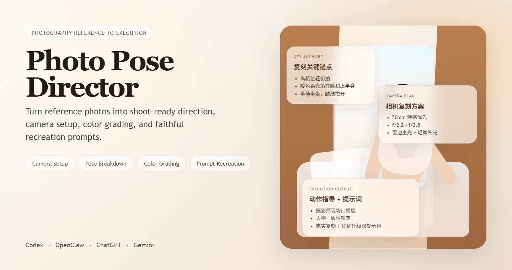

# Photo Pose Director Skills



> 从参考图到可执行复刻方案。

面向摄影师、人像创作者和 AI 生图用户的参考图分析与复刻技能仓库。它把一张参考图拆成真正可执行的复刻路径：看懂画面、指导模特、还原相机拍法，并生成尽量贴近原图的复刻提示词。


## 核心价值

- 分析参考图，提炼真正决定“像不像”的复刻关键锚点。
- 指导真人拍摄，给出机位、焦段、参数、布光、后期和现场口播指令。
- 生成 AI 复刻提示词，在保留人物一致性的前提下做忠实复刻或优化升级。

## 为什么它更专业

- `复刻关键锚点`：先告诉你哪些元素必须保留，避免只学到表面动作。
- `相机复刻方案`：给出更贴近原图风格的机位、镜头感、曝光和布光建议。
- `摄影师现场口播`：把动作拆成现场真的能说出口的短指令。
- `人物一致性锁定`：复刻时优先保住种族、年龄感、发型、身材和气质。

## 快速开始

### Codex

- 技能目录：[skills/codex/photo-pose-director](skills/codex/photo-pose-director)
- 安装位置：`~/.codex/skills/photo-pose-director`
- 调用示例：

```text
Use $photo-pose-director to analyze this reference image in Chinese, identify the replication anchors, give camera position and settings, direct the model on set, suggest color grading, keep the subject consistent, and generate short recreation and upgrade prompts.
```

### OpenClaw

- 技能目录：[skills/openclaw/photo_pose_director](skills/openclaw/photo_pose_director)
- 安装位置：
  - 工作区：`<workspace>/skills/photo_pose_director`
  - 全局：`~/.openclaw/skills/photo_pose_director`
- 调用示例：

```text
分析这张参考图，告诉我复刻关键锚点、相机拍摄方案、动作指导、后期调色方向和 AI 复刻提示词。
```

### ChatGPT

- 安装包目录：[platform-packs/chatgpt](platform-packs/chatgpt)
- 使用方式：
  - `custom-gpt/` 用于创建自定义 GPT
  - `instructions/` 用于配置 Custom Instructions

### Gemini

- 安装包目录：[platform-packs/gemini](platform-packs/gemini)
- 使用方式：
  - `gem/` 用于创建 Gemini Gem
  - `instructions/` 用于长期系统指令配置

## 示例与下载

- 最新发布包：[v1.1.0 Release](https://github.com/seenne/photo-pose-director-skills/releases/tag/v1.1.0)
- 可下载附件：
  - `photo-pose-director-codex-v1.1.0.zip`
  - `photo-pose-director-openclaw-v1.1.0.zip`
  - `photo-pose-director-chatgpt-v1.1.0.zip`
  - `photo-pose-director-gemini-v1.1.0.zip`

### 真人拍摄复刻示例

- [真人拍摄复刻示例目录](examples/real-shoot-recreation/README.md)
- [室内柔光私房](examples/real-shoot-recreation/indoor-soft-private-portrait.md)
- [窗边自然光人像](examples/real-shoot-recreation/window-light-portrait.md)
- [户外街拍氛围人像](examples/real-shoot-recreation/outdoor-street-portrait.md)
- [情绪化坐姿半躺构图](examples/real-shoot-recreation/moody-seated-recline.md)

## 适合谁用

- 摄影师
- 人像爱好者
- 私房 / 写真人像创作者
- 用参考图拆动作的人
- 想把真人拍摄逻辑迁移到 AI 生图的人

## 默认输出

默认会优先围绕复刻执行输出以下内容：

1. 复刻关键锚点
2. 相机复刻方案
3. 拍摄手法分析
4. 摄影师一句话动作指导
5. 摄影师现场口播版
6. 动作拆解
7. 真人拍摄注意事项
8. AI 复刻注意事项
9. 人物一致性锁定
10. 忠实复刻版提示词
11. 优化升级版提示词

## 文档与设计来源

- [初版设计](docs/superpowers/specs/2026-03-26-photo-pose-director-design.md)
- [复刻优先升级设计](docs/superpowers/specs/2026-03-26-photo-pose-director-replication-first-upgrade-design.md)
- [GitHub 首页优化设计](docs/superpowers/specs/2026-03-26-github-home-polish-design.md)
- [Photo Pose Director 实现计划](docs/superpowers/plans/2026-03-26-photo-pose-director.md)
- [GitHub 首页优化计划](docs/superpowers/plans/2026-03-26-github-home-polish.md)

## 许可证

本项目采用 [MIT License](LICENSE)。
